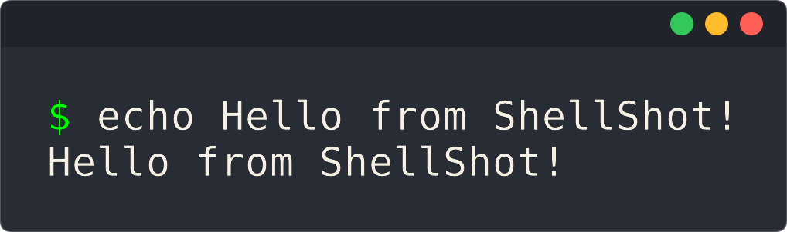
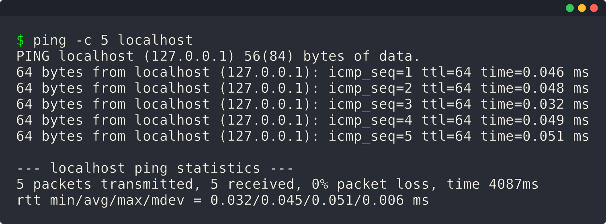

<div align="center">

<h1>Shellshot</h1>

[](https://crates.io/crates/shellshot)
[](https://github.com/lhenry-dev/shellshot/actions/workflows/ci.yml?branch=main)
[](https://deps.rs/repo/github/lhenry-dev/shellshot)
[](https://docs.rs/shellshot)
[](https://crates.io/crates/shellshot)
[](https://github.com/rust-lang/rust/releases/tag/1.85.1)
[](https://codecov.io/gh/lhenry-dev/shellshot)

---

**Transform your command-line output into clean, shareable images with a single command.**

</div>

`Shellshot` is a fast, cross-platform tool written in Rust that captures terminal sessions and transforms them into polished screenshots. Perfect for documentation, presentations, social media, or showcasing terminal workflows.

## Features

- **Beautiful Rendering**: High-quality image generation with customizable window decorations
- **ANSI Support**: Correctly renders ANSI colors, styles, and formatting.
- **Clipboard Integration**: Copy screenshots directly to your clipboard with one flag
- **Command Execution**: Execute commands and capture their output automatically
- **Customizable**: Adjust window decorations, colors, padding, and output filename.
- **Cross-Platform**: Works on Windows and Linux

## Installation

```bash
cargo install shellshot
```

## Usage Examples

### Basic Usage

```bash
shellshot echo "Hello from ShellShot!"
```

This will execute the command, capture its output, and generate an image file named `out.png` in the current directory.



```bash
shellshot ping -c 5 localhost
```



### Command Options

#### `--no-decoration`

Remove window decorations (title bar and control buttons):

```bash
shellshot --no-decoration echo "Hello, World!"
```

#### `--decoration <style>` / `-d`

Specify the decoration style (default: `classic`):

```bash
shellshot --decoration classic ls -la
```

#### `--output` / `-o`

Specify a custom output filename:

```bash
shellshot --outpout my-screenshot.png cargo build
shellshot --output screenshots/build.png cargo test
```

#### `--clipboard`

Copy the screenshot directly to your clipboard:

```bash
shellshot --clipboard git status
```

#### `--width` / `-W` et `--height` / `-H`

Specify the final image dimensions in pixels or 'auto' (default: auto):

```bash
shellshot --width 800 --height 600 echo "Hello, world!"
```

#### `--timeout` / `-t`

Set a timeout in seconds for command execution (0 = no timeout):

```bash
shellshot --timeout 5 ping -c 10 localhost
```

### Examples

```bash
shellshot echo "Hello, Shellshot!"
shellshot --decoration classic ls --color=always
shellshot --output docs/example.png cargo --version
shellshot --clipboard git log --oneline -5
shellshot --no-decoration python --version
```
